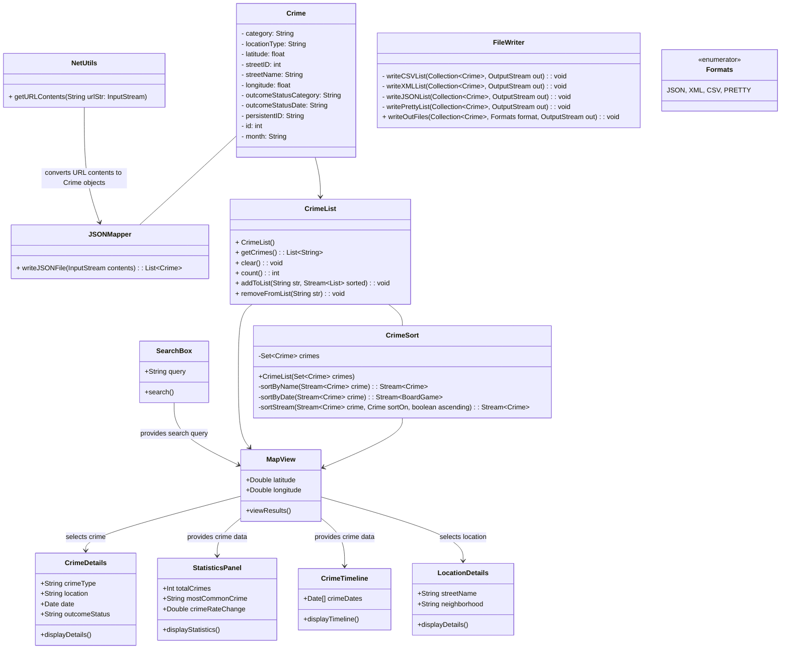

# Design Documents

You may have multiple design documents for this project. Place them all in this folder. File naming is up to you, but it should be clear what the document is about. At the bare minimum, you will want a pre/post UML diagram for the project. 

OVERVIEW

Our app will take UK crime data and display it on an interactive map using the longitude and latitude associated with each crime report. The data comes from crimes committed in January 2023 in Leicester, England. It includes the following categories of crimes: 

    anti-social behaviour
    bicycle-theft
    burglary
    criminal damage arson
    drugs
    other theft
    possession of weapons
    public order
    robbery
    shoplifting
    theft from the person
    vehicle crime
    other crime

A typical crime report inludes data like the category of crime, the longitude and latitude of where it was committed, an ID number, the month the crime was committed, and an outcome status if the case has been resolved. 

The app will read in the JSON-formatted data from the UK police data API, put the data into a list that can be sorted by category, and then displayed on a map using the latitude and longitude points included with each crime report. 

Users will also be able to create their own sub-lists and write them out in various file formats. 

```mermaid
---
FINAL UML
---
classDiagram
    class CrimeView {
        - panel: JPanel
        - categories: JComboBox<String>
        - crimeButton: JButton
        - addCrimeButton: JButton
        - mapButton: JButton
        - statsButton: JButton
        - clearListButton: JButton
        - saveButton: JButton
        - exitButton: JButton
        - topPanel: JPanel
        - buttonPanel: JPanel
        - eastPanel: JPanel
        - mapPane: JScrollPane
        - infoPane: JScrollPane
        - statsPane: JScrollPane
        - listOfCrimesPane: JScrollPane
        - info: JTextArea
        - stats: JTextArea
        - listOfCrimes: JTextArea

        + CrimeView()
        + getCategories(): JComboBox<String>
        + getCrimeButton(): JButton
        + getAddCrimeButton(): JButton
        + getMapButton(): JButton
        + getStatsButton(): JButton
        + getClearListButton(): JButton
        + getSaveButton(): JButton
        + getExitButton(): JButton
        + getInfo(): JTextArea
        + getStats(): JTextArea
        + getListOfCrimes(): JTextArea
        + getMapPane(): JScrollPane
    }
    class CrimeController {
        - view: CrimeView
        - model: CrimeManager
        - addedCrimes: List<Crime>
        - crimeSearchClicked: boolean
        + CrimeController(view: CrimeView, model: CrimeManager)
        + initializeCategories(): void
        + initializeMap(): void
        + createMapImage(imageUrl: String): void
        + getMarkersForCategory(category: String): String
        }
        class crimeSearchListener {
            + actionPerformed(e: ActionEvent): void
        }
        class mapListener {
            + actionPerformed(e: ActionEvent): void
            + getMarkersForCategory(category: String): String
        }
        class addCrimeListener {
            + actionPerformed(e: ActionEvent): void
        }
        class statsListener {
            + actionPerformed(e: ActionEvent): void
        }
        class clearListListener {
            + actionPerformed(e: ActionEvent): void
        }
        class saveCrimeListener {
            + actionPerformed(e: ActionEvent): void
        }
        class exitListener {
            + actionPerformed(e: ActionEvent): void
        }
    class Main {
        + main(args: String[]): void
    }
    class NetUtils {
        + getURLContents(String urlStr: InputStream)
        + writeJSONToCrimeList(): List~CrimeBean~
        + convertJSONToString(String filePath): String
    }
    class Crime {
        - category: String
        - locationLatitude: String
        - streetID: int
        - streetName: String
        - locationLongitude: String
        - outcomeCategory: String
        - outcomeDate: String
        - persistentID: String
        - id: int
        - month: String
        + getCategory(): String
        + getLocationLatitude(): String
        + getStreetID(): int
        + getStreetName(): String
        + getLocationLongitude(): String
        + getOutcomeCategory(): String
        + getOutcomeData(): String
        + getPersistentID(): String
        + getID(): int
        + getMonth(): String
        + toString(): String
        + getInfo(): String
        + equals(Object o): boolean
        + hashCode(): int
    }
    class CrimeBean {
        - category: String
        - location_type: String
        - location: Location
        - context: String
        - outcomeStatus: OutcomeStatus
        - persistentID: String
        - ID: int
        - locationSubtype: String
        - month: String
        - unpackLocationFromNestedObject(Map~String, Object~ location): void
        - unpackOutcomeStatusFromNestedObject(Map~String, Object~ outcomeStatus): void
        + getCategory(): String
        + setCategory(String category): void
        + getLocation_type(): String
        + setLocation_type(String location_type): void
        + getOutcomeStatus(): OutcomeStatus
        + setPersistentID(String persistentID): void
        + getPersistentID(): String
        + setID(int id): void
        + getId(): int
        + getMonth(): String
        + getLatitude(): String
        + getLongitude(): String
        + getStreetName(): String
        + toString(): String
        + class Location 
        - latitude: String
        - street: Street
        - longitude: String
        + getLatitude(): String
        + setLatitude(String latitude): void
        + getStreet(): Street
        + setStreet(Street street): void
        + getLongitude(): String
        + setLongitude(String longitude): void
        + toString(): String
        + class Street 
        - id: int
        - name: String
        + toString(): String
        + getId(): int
        + setId(int id): void
        + getName(): String
        + setName(String name): void
        + class OutcomeStatus 
        - category: String
        - date: String
        + toString(): String
        + getCategory(): String
        + setCategory(String category): void
        + getDate(): String
        + setDate(String date): void
}
    class CrimeBeanMapper {
        + map(CrimeBean bean): Crime
}
    class CrimeXmlWrapper {
        - crime: Collection~Crime~
        + CrimeXmlWrapper(Collection ~crimes~)
}
    class FileReaderFormatter {
        + loadfile(String filePath): InputStream
        + readXmlInput(InputStream in): List~Crime~
        + readJsonInput(InputStream in): List~Crime~
        + readCsvInput(InputStream in): List~Crime~
        + read(String filePath): List~Crime~
}
    class FileWriterFormatter {
        - prettyPrint(Collection~Crime~ crimes, OutputStream out): void
        + prettySingle(Crime crime, PrintStream out): void
        + writeXmlData(Collection~Crime~ crimes, OutputStream out): void
        + writeJsonData(Collection~Crime~ crimes, OutputStream out): void
        + writeCSVData(Collection~Crime~ crimes, OutputStream out): void
        + write(Collection~Crime~ crimes, Formats format, OutputStream out): void
}
    class Formats {
    <<enumerator>>
    JSON, XML, CSV, PRETTY
    }
    class CrimeManager {
        + CrimeManager()
        + addCrime(Crime crime) : void
        + addSpecificCrimes(List<Crime> newCrimes) : void
        + clearCrimes() : void
        + countCrimes() : int
        - sortCrimes() : void
        + getCrimes() : List<Crime>
        + saveCrimesToFile(String filename), : void
    }
    
    Main --> CrimeView : creates
    Main --> CrimeManager : creates
    Main --> CrimeController : creates
    CrimeController --> CrimeView : uses
    CrimeController --> CrimeManager : uses
    NetUtils --> CrimeManager : creates list of Crimes
    NetUtils --> CrimeBean : uses
    NetUtils --> CrimeBeanMapper : uses
    NetUtils --> Crime : uses
    Crime --> CrimeManager
    CrimeManager --> CrimeView
    CrimeManager --> CrimeView
    CrimeController --> FileWriterFormatter : uses
    FileWriterFormatter --> CrimeXmlWrapper : uses

```

