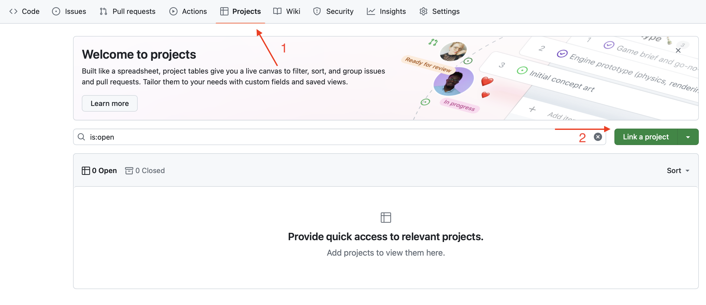
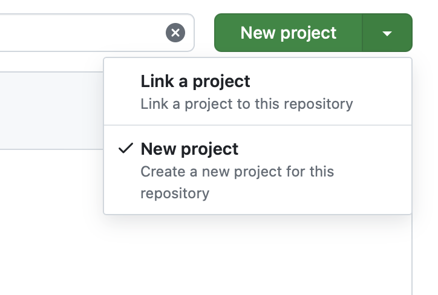
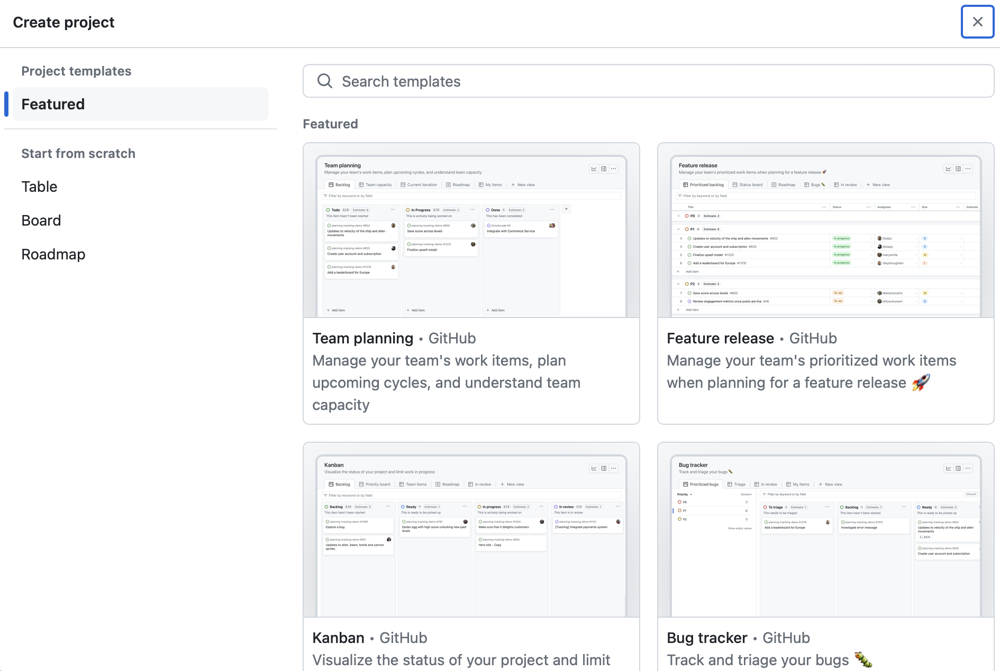
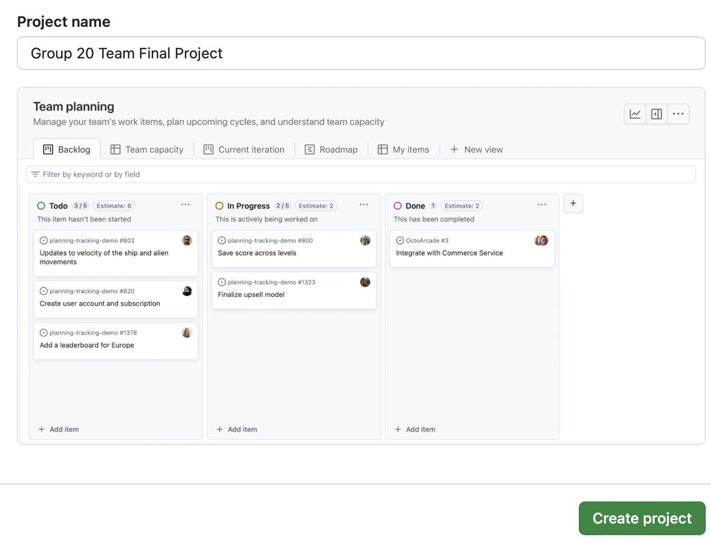
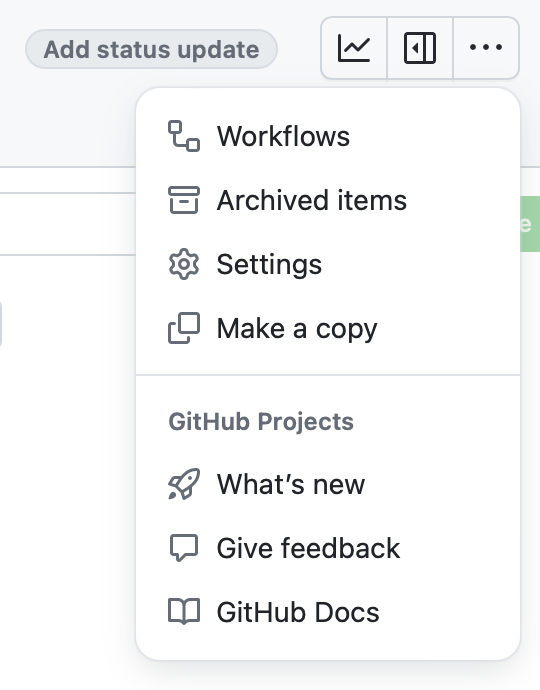
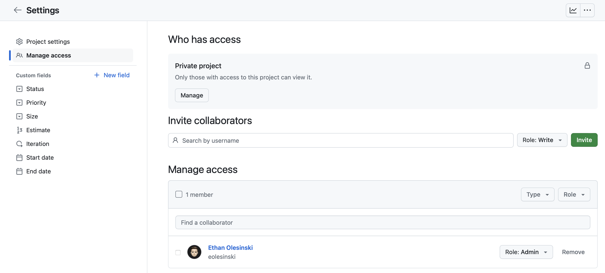
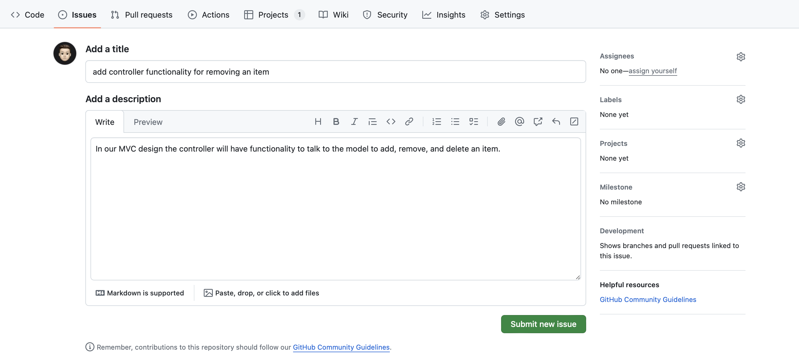
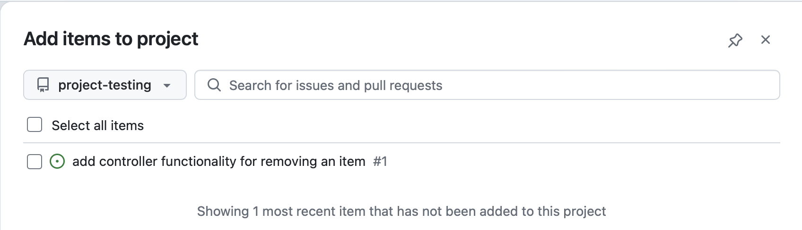

# GitHub Projects

GitHub Projects are a project managment tool that integrates directly with your existing repositories. You will set this up as part of your team's final project to help your team assigning and managing work. You can read more about [GitHub Projects here](https://docs.github.com/en/issues/planning-and-tracking-with-projects/learning-about-projects/quickstart-for-projects).

*Note: only one member of your team (the one who owns the repo for your team's final project) needs to enable the GitHub project feature for that repository. Once others are given access, they will be able to view and edit the project.*

The instructions below will show you how to setup/enable a GitHub Project Board for your team and how to create new issues to track/assign work for the project.

## How to set up GitHub Projects for your team

1. Navigate to your team's final project GitHub repo, click on the Projects tab at the top, and then select the drop down arrow on the right side of the green button

 

2. Switch it to "New Project" and then click it

 

 

3. Select a template from the project list *(you can use the team planning or Kanban board template)*

 

4. Give your project a name and then click create project

 

### What is Kanban and why do we use it in Software Development?

The board above has three columns: "To Do," "In Progress," and "Done." Why? In our classes, we are used to working on small coding projects individually where we are the only ones interacting with our code. When you inevitably begin working on coding projects in the industry (either through an internship or at a job), you will almost certainly be working on a team, not just coding in isolation. In fact, it is highly likely that the codebase you will be contributing to will be very large, and you will be writing code alongside many other developers.

How do all of these developers know what part of the project to work on and how do they keep track of what they are working on? As you can imagine, the more developers you have working on the same project, the more difficult it can become to determine exactly who is doing what and when. This is where Kanban-style boards come in (like the Kanban and Team Management boards above).

Kanban is a methodology that was originally developed by Toyota to help improve the operational efficiency of their auto manufacturing plants. A [Kanban board](https://www.atlassian.com/agile/kanban/boards) is a visual project management tool that helps to track work as it moves through a system, aiding in organization and efficiency.

[Kanban](https://en.wikipedia.org/wiki/Kanban_(development)) comes into play in software development as one of the many components of Agile (or SCRUM) that helps teams of software developers stay organized and manage their work. Normally, teams accumulate "work to do" in something called a backlog. This can be represented on your board by the "To Do" section. Next, a team of developers and a project manager would get together on a weekly basis to assign tasks from the backlog and determine which tasks to prioritize for that week. In this case, our backlog is filled with tickets (or issues) - more on that later.

As the week progresses, tasks get moved from the "To Do" column, to the "In Progress" column, and then finally to the "Done" column. This helps teams take stock of what was accomplished and identify what is left to do. Don't worry if not everything gets done! The board is just supposed to be a guideline, and tasks often take either longer or shorter than we expect. Regular communication with your team can help ensure that you are getting the right amount of work done for part of the project.

> [!NOTE]
> Since the main focus of this course is on Object-Oriented programming and not Software Development, you don't need to worry too much about how structured your team's process is for managing your project board. It can be as informal as adding new items and then letting your other team members know or setting aside the first few minutes of group meetings to go over the board. The key part of having this set up is that you are using it as a way to help track and document the work on your project. This will help you, your team, and the TAs track the overall work and progress that your team is making on your project.

### Adding group members to your GitHub Project

This section describes how to manage access to your GitHub Project and add your team members.

> [!IMPORTANT]
> By default, only the person who creates the GitHub Project has access to add, move, or delete items from the project board. For your group project, you will want to make sure that you add everyone in your group to the project (including the TA responsible for overseeing your group). Although the TA will not make any edits to your team’s board directly, adding them to the project will allow them to see the tasks that your team includes and track your team’s progress.

**To add a new member to your project, follow these steps:**

1. Click on the Project settings from the menu on the upper right-hand side of the Project window (the three dots icon).

 

 

2. Search for your team member by thier GitHub username and invite them to collaborate

 

 

> [!NOTE]  
> You can manage a user’s role (permissions) to the Project by clicking on the roles dropdown. The TA for your group should be given Read access to view the project 

## How to add a new item to your Team's project board

Now that we have a project board and our team members added to it, how do we actually use it? As mentioned above, the flow of progress moves from: **"To Do"** -> **"In Progress"** -> **"Done."** The only thing left to do is actually add issues/tasks to our board. This raises the question, **what is an issue?**

In GitHub, an **issue** is a way to track tasks, bugs, or features related to your project. It serves as a place to describe the problem or task, discuss potential solutions, and keep track of its progress. Issues help you organize work and communicate within your team about what needs to be done.

Issues can be added directly to your Project board. There are two ways to add an item:

1. Create an Issue in Your Team’s Final Project repository and then link it to the board.

2. Create a New Item directly on the Board.

We will walk through the steps for each of these approaches below:

### Add item from repository

#### Create a new Issue

On the Issues tab of your repository, you can create a new issue for a task that needs to be done for your project.

 

> [!NOTE]
> The level of granularity you choose for your issues is up to you. For example, you might want to split up the controller functionality for the MVC (add, remove, etc.) into three separate issues or contain all of them in one. There is no right or wrong way to do this; it is similar to deciding how often to commit in Git.

Once an issue is in your repository you can link to it when adding a new item on your Project board.

#### Adding the issue to your Project board

Select the add item from repository, make sure that you are in your final project's repo and then select the issue that you would like to add.

### Create new Issue

The same steps as above excpet you can create the issue directly form the add item button on your Project board.

### Moving items around on your board

Once an item is on your board you can drag and drop it to move it around. 

