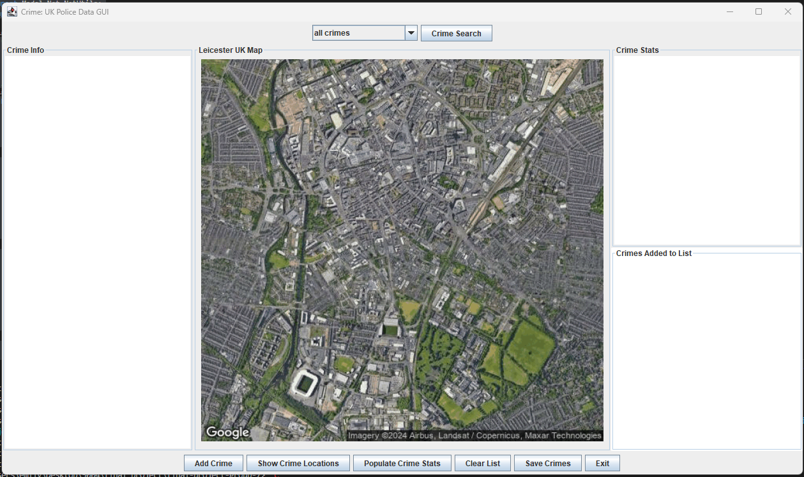
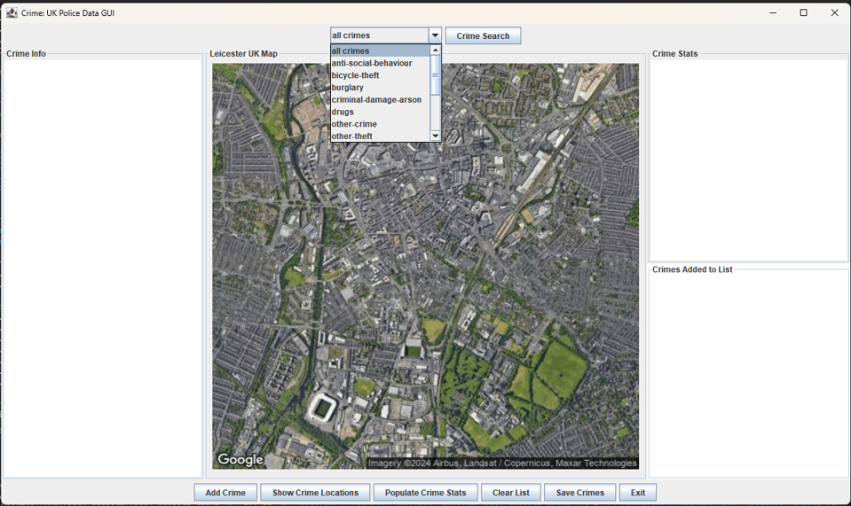
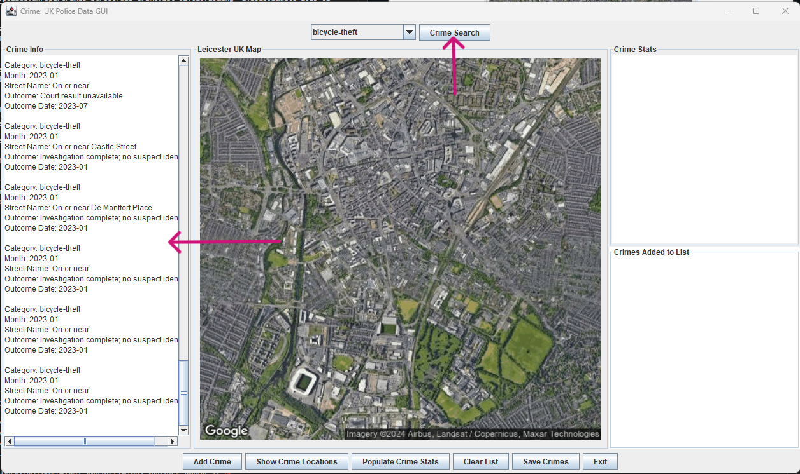
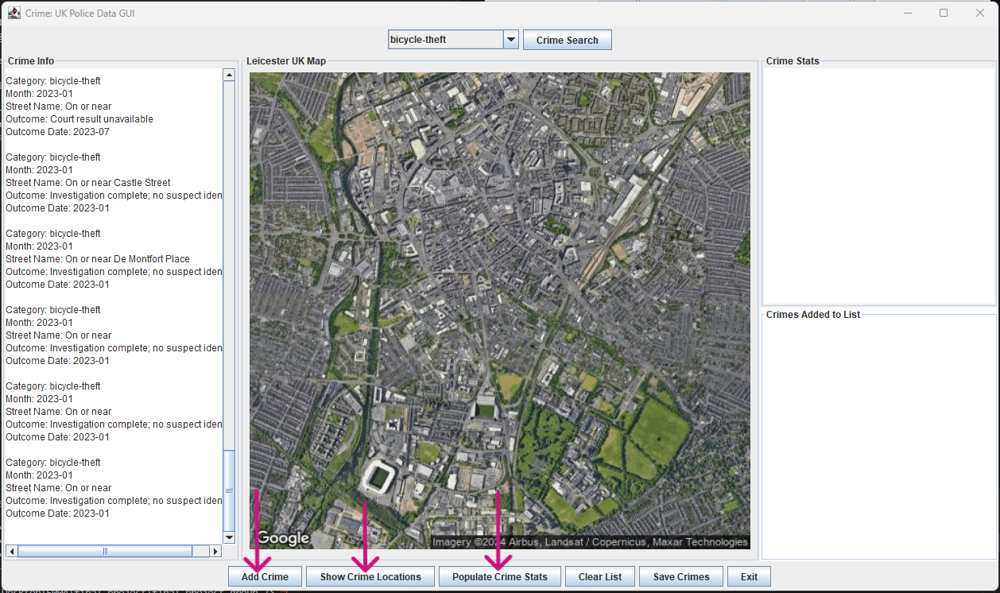
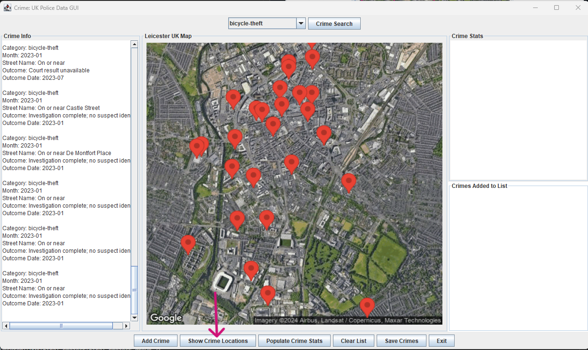
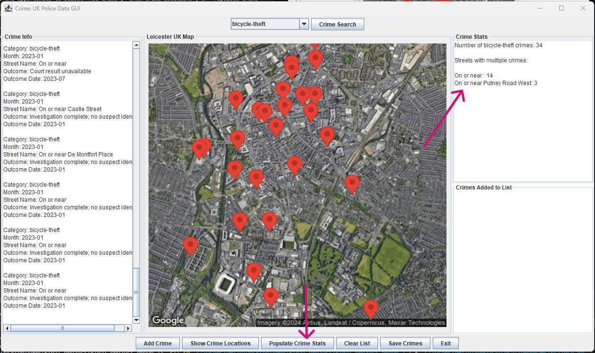
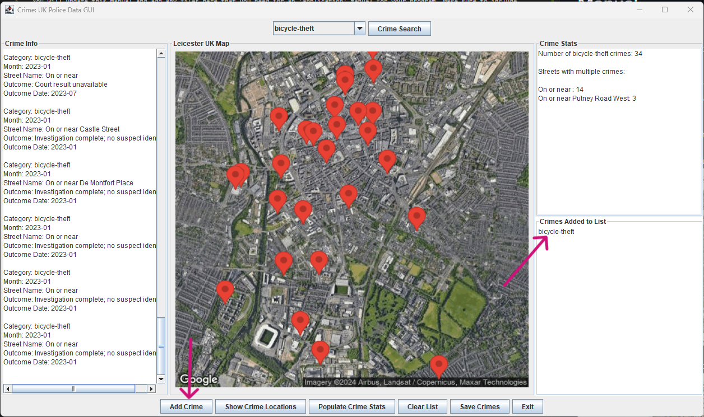
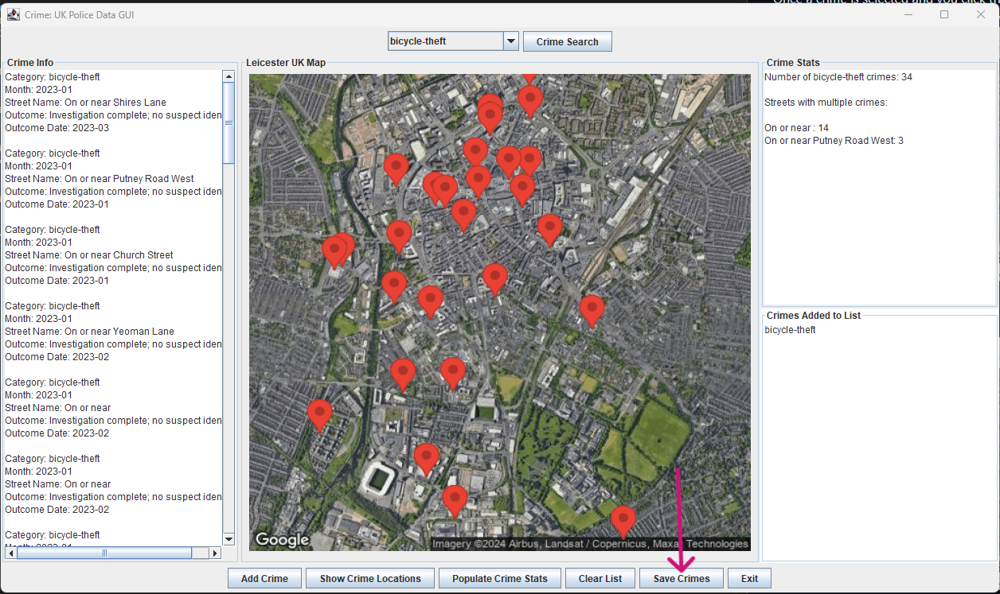

# Manual 

You will update this manual and add any files here that you need for an 'application' manual for your program. Make sure to include screenshots of various features. 

API: 
https://data.police.uk/api/crimes-street/all-crime?lat=52.629729&lng=-1.131592&date=2023-01

When the program is run this is how the GUI displays:
Crime category dropdown and 'Crime Search' on the top,
'Crime Info' pane on the left,
'Crime Stats' and 'Crimes Added to List' sections on the right,
Map of Leicester UK in the center,
Various interactive buttons on the bottom

The first step is to select and category from the drop down menu:

Once a crime is selected and you click the 'Crime Search' buttton, all of the crimes from that category will be displayed in the 'Crime Info' section

Next you have the opportunity to select 'Add Crime', 'Show Crime Locations', or 'Populate Crime' Stats:

When 'Show Crime Locations' button is clicked the map will poplate with markers showing the selected crimes locations.

When 'Populate Crime Stats' button is clicked the 'Crime Stats' section with be populated with crime stats. (Number of crimes, number of crimes per street if > 1)

When 'Add Crime' button is clicked the 'Crimes Added to List' section will display the current category:

You can then click the 'Save Crime' button and the current crimes added to the list will be saved to an xml file. (crimes.xml)

